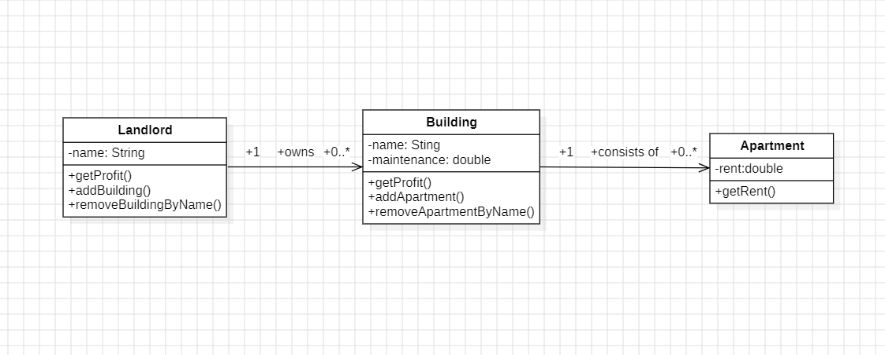

# Q2

## Class Diagram



## Code

**Main.java**

```java
public class Main {
    public static void main(String[] args) {
        Landlord l1 = new Landlord("John Doe");
        Building b1 = new Building("JD-B1", 100);
        b1.addApartment(new Apartment("JD-B1-A1", 500));
        b1.addApartment(new Apartment("JD-B1-A2", 500));
        b1.addApartment(new Apartment("JD-B1-A3", 500));
        l1.addBuilding(b1);

        Building b2 = new Building("JD-B2", 80);
        b2.addApartment(new Apartment("JD-B2-A1", 300));
        b2.addApartment(new Apartment("JD-B2-A2", 350));
        l1.addBuilding(b2);

        System.out.printf("Profit for landlord %s is $%.2f/month\n", l1.getName(), l1.getProfit());

        Landlord l2 = new Landlord("Tom Scott");
        Building b3 = new Building("TS-B1", 200);
        b3.addApartment(new Apartment("TS-B1-A1", 1000));
        b3.addApartment(new Apartment("TS-B1-A2", 950));
        b3.addApartment(new Apartment("TS-B1-A3", 1000));
        l2.addBuilding(b3);

        Building b4 = new Building("TS-B2", 250);
        b4.addApartment(new Apartment("TS-B2-A1", 1250));
        b4.addApartment(new Apartment("TS-B2-A2", 1300));
        l2.addBuilding(b4);

        System.out.printf("Profit for landlord %s is $%.2f/month\n", l2.getName(), l2.getProfit());

    }
}
```

**Landlord.java**

```java
import java.util.ArrayList;

public class Landlord {
    private ArrayList<Building> buildings;
    private String name;

    public Landlord(String name) {
        this.name = name;
        this.buildings = new ArrayList<>();
    }

    public double getProfit(){
        double buildingProfit = 0;
        for (Building building : buildings) {
            buildingProfit += building.getProfit();
        }
        return buildingProfit;
    }

    public void addBuilding(Building building) {
        this.buildings.add(building);
    }

    public void removeBuildingByName(String name){
        buildings.removeIf(building -> building.getName().equals(name));
    }

    public String getName() {
        return name;
    }

    public void setName(String name) {
        this.name = name;
    }
}

```

**Building.java**

```java
import java.util.ArrayList;
import java.util.NoSuchElementException;

public class Building {
    private ArrayList<Apartment> apartments;
    private String name;
    private double maintenance;

    public Building(String name, double maintenance) {
        this.name = name;
        this.maintenance = maintenance;
        this.apartments = new ArrayList<>();
    }

    public double getProfit(){
        double apartmentProfit = 0;
        for (Apartment apartment : apartments) {
            apartmentProfit += apartment.getRent();
        }
        return apartmentProfit - maintenance;
    }

    public void addApartment(Apartment apartment) {
        this.apartments.add(apartment);
    }

    public void removeApartmentByName(String name){
        apartments.removeIf(apartment -> apartment.getName().equals(name));
    }

    public String getName() {
        return name;
    }

    public void setName(String name) {
        this.name = name;
    }

    public double getMaintenance() {
        return maintenance;
    }

    public void setMaintenance(double maintenance) {
        this.maintenance = maintenance;
    }
}

```

**Apartment.java**

```java
public class Apartment {
    private double rent;
    private String name;

    public Apartment( String name, double rent) {
        this.rent = rent;
        this.name = name;
    }

    public double getRent() {
        return rent;
    }

    public String getName() {
        return name;
    }

    public void setRent(double rent) {
        this.rent = rent;
    }

    public void setName(String name) {
        this.name = name;
    }
}

```
